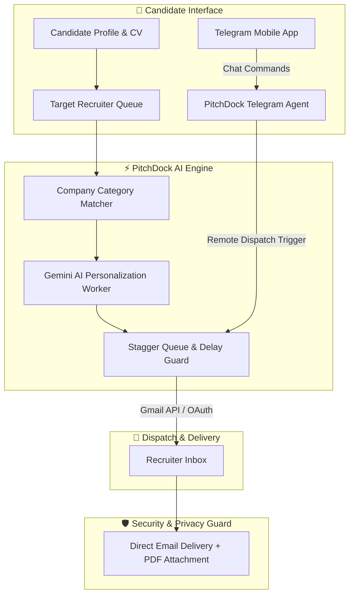

# PitchDock
### Skip the ATS. Land directly in the recruiter's inbox.

An AI-powered recruiter outreach engine designed to connect job seekers directly with hiring managers through personalized cold emails, PDF résumé attachments, deliverability pacing, and Telegram mobile remote control.

---

## 🌟 Vision & Overview

Traditional job portals drop candidate résumés into black-hole Applicant Tracking Systems (ATS) where automated keyword parsers reject up to 75% of qualified applicants before a human recruiter ever sees them.

**PitchDock** reimagines the job hunt by automating personalized, high-converting cold email outreach directly to targeted technical recruiters and talent acquisition leads.

Rather than sending generic bulk emails, PitchDock matches a candidate's background against company categories, rewrites key accomplishments specifically for each target, attaches a PDF résumé, and paces out dispatches so every message arrives naturally in the recruiter's primary inbox.

---

## ⚡ What PitchDock Does

### 🎯 01 · Context-Aware Pitch Personalization
PitchDock's AI engine analyzes a candidate’s work history and matches key technical highlights against the target recruiter’s company profile (e.g., MNC Product, IT Services, Staffing Agency). Accomplishments are dynamically rewritten to align with the specific role expectations.

### ✉️ 02 · Direct Inbox Routing via Gmail API
Integrates directly with Google OAuth (`https://www.googleapis.com/auth/gmail.send`) to dispatch emails directly through the user's authentic Gmail account.
* Every message includes a real PDF résumé attachment (not an untrusted third-party download link).
* Zero inbox reading, indexing, or data retention—strictly send-only authorization.

### 🛡️ 03 · Deliverability & Stagger Queue Guard
Bulk email blasts get flagged as spam. PitchDock features an automated deliverability pacing engine that spaces out email sends across batches, enforcing strict daily quotas to preserve domain reputation and guarantee high deliverability.

### 📱 04 · Telegram Mobile Remote Copilot
Never lose momentum on your job search. PitchDock includes a dedicated **Telegram Mobile Agent** that allows users to monitor and trigger outreach campaigns from their phone:
* **/link CODE**: Secure 1-click single-use token pairing between Telegram and PitchDock accounts.
* **status**: Check live campaign progress, daily send quotas, and pending recruiter queues in real time.
* **send 5 emails**: Remote execution of email dispatches from Telegram chat.
* **Natural Language AI**: Ask questions about queue status or pending drafts anytime.

### 🔒 05 · Enterprise Security & Data Privacy
Designed in strict compliance with the **Google API Services User Data Policy**. User credentials, OAuth tokens, and candidate data are secured with local database storage, isolated session tokens, and strict privacy guards.

---

## 🔄 System Architecture & Execution Pipeline

---

## 💎 Core Platform Capabilities

| Capability | PitchDock | Manual Cold Pitching | Bulk Email Tools |
| :--- | :---: | :---: | :---: |
| **Personalized Pitch Accomplishments** | **✓ AI-tailored per recruiter** | ✓ Manual & slow | ✕ Single template |
| **Direct Résumé PDF Attachment** | **✓ Attached automatically** | ✓ Supported | ✕ Links only (spam risk) |
| **Send Pacing & Delay Guard** | **✓ Staggered safety queue** | — Not applicable | ✕ Bulk blasts (domain risk) |
| **Telegram Remote Control** | **✓ Full chat control** | ✕ No mobile bot | ✕ No mobile bot |
| **Company Category Matcher** | **✓ MNC / IT / Service filter** | ✓ Manual search | ✕ Static list only |

---

## 🛡️ Security, Privacy & Google Compliance

PitchDock prioritizes user trust and security above all else:

1. **Gmail Send Scope (`gmail.send`)**: PitchDock requests only the minimal scope required to deliver outreach emails authorized by the candidate.
2. **Zero Read Policy**: PitchDock **never** reads, scans, indexes, or stores your Gmail inbox messages, personal threads, or contacts.
3. **Data Protection**: User credentials and OAuth tokens are stored safely with encryption at rest.
4. **Google User Data Policy**: Full compliance with the [Google API Services User Data Policy](https://developers.google.com/terms/api-services-user-data-policy).

---

**PitchDock** — *Reach the recruiter, not the filter.*

[Visit pitchdock.xyz](https://www.pitchdock.xyz) · [Privacy Policy](https://www.pitchdock.xyz/privacy) · [Terms of Service](https://www.pitchdock.xyz/terms)

